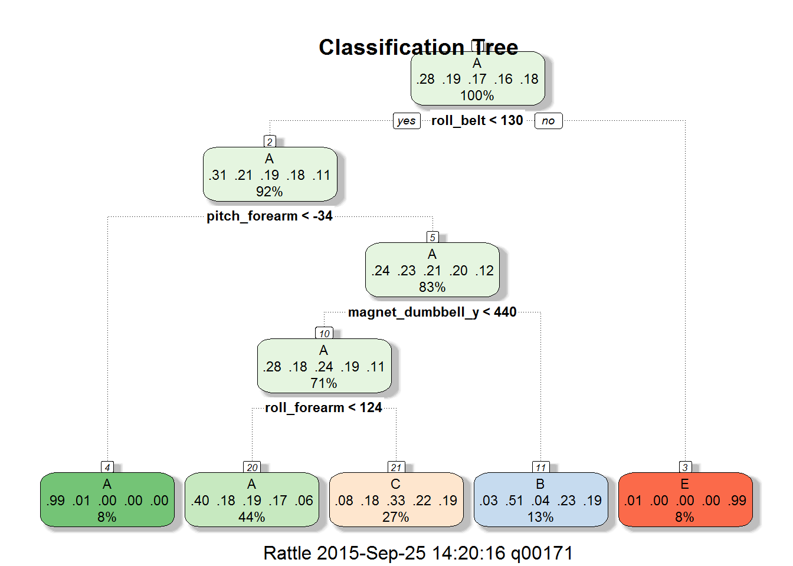

# Human Activity Recognition
#

### Load the required libraries

```r
library(AppliedPredictiveModeling)
library(caret)
```

```
## Loading required package: lattice
## Loading required package: ggplot2
```

```r
library(rattle)
```

```
## Loading required package: RGtk2
## Rattle: A free graphical interface for data mining with R.
## Version 3.5.0 Copyright (c) 2006-2015 Togaware Pty Ltd.
## Type 'rattle()' to shake, rattle, and roll your data.
```

```r
library(rpart.plot)
```

```
## Loading required package: rpart
```

```r
library(randomForest)
```

```
## randomForest 4.6-10
## Type rfNews() to see new features/changes/bug fixes.
```

##Background
#### It is now possible to collect a large amount of personal activity data using devices like Fitbit inexpensively.
#### The data collected from these devices can be used to quantify the work out of the individuals.
#### In this project, out goal is to study the data from accelerometers of 6 individuals and 
#### construct a model using the training data set and to predict the outcome for the test data set 
#### provided to us.  
##
###  Here are the classifications to be predicted:
#### Class A  - According to the specification 
#### Class B  - Throwing the elbows to the front 
#### Class C  - Lifting the dumbbell only halfway
#### Class D  - Lowering the dumbbell only halfway 
#### Class E  - Throwing the hips to the front 

### Set the working directory and download the training and test data sets


```r
setwd("C:/Coursera/R/MachineLearning")
setInternet2(use = TRUE)
training_url <- "https://d396qusza40orc.cloudfront.net/predmachlearn/pml-training.csv"
train_data_file_name <- "pml-training.csv"

if (!file.exists(train_data_file_name)) {
        download.file(url=training_url, destfile=train_data_file_name)
}        

testing_url <- "https://d396qusza40orc.cloudfront.net/predmachlearn/pml-testing.csv"
test_data_file_name<- "pml-testing.csv"

if (!file.exists(test_data_file_name)) {
        download.file(url=testing_url, destfile=test_data_file_name)
}

df_training <- read.csv(train_data_file_name, na.strings=c("NA",""), header=TRUE)
colnames_train <- colnames(df_training)
df_testing <- read.csv(test_data_file_name, na.strings=c("NA",""), header=TRUE)
colnames_test <- colnames(df_testing)
```

### Dropping columns that contain NAs for more than 70% of the values and remove the columns not used in prediction.
### Used the reverse index (from length to 1 with step -1) to avoid making a copy of the data frame(s)


```r
len <- length(df_training)
for(i in seq(len,1,-1)) { #loop through all the columns
        if( sum( is.na( df_training[, i]))/nrow(df_training) >= 0.7 ) { # check if more than 70% are NAs in the ith column
                for(j in 1:length(df_training)) { # locate that column 
                        if( length( grep(names(df_training[i]), names(df_training)[j]) ) == 1)  { # column found?
                                df_training <- df_training[ , -j] #Remove that column from the training data set
                                df_testing <- df_testing[, -j]    #Remove that column from the test data set
                        }   
                } 
        }
}
### Remove the first 7 columns from training and test data sets since they are not used for predicting
df_training <- df_training[,8:length(colnames(df_training))]
df_testing <- df_testing[,8:length(colnames(df_testing))]
```


### Check if there are any near zero variance columns to can be eliminated

```r
nzv <- nearZeroVar(df_training, saveMetrics=TRUE)
nzv
```

```
##                      freqRatio percentUnique zeroVar   nzv
## roll_belt             1.101904     6.7781062   FALSE FALSE
## pitch_belt            1.036082     9.3772296   FALSE FALSE
## yaw_belt              1.058480     9.9734991   FALSE FALSE
## total_accel_belt      1.063160     0.1477933   FALSE FALSE
## gyros_belt_x          1.058651     0.7134849   FALSE FALSE
## gyros_belt_y          1.144000     0.3516461   FALSE FALSE
## gyros_belt_z          1.066214     0.8612782   FALSE FALSE
## accel_belt_x          1.055412     0.8357966   FALSE FALSE
## accel_belt_y          1.113725     0.7287738   FALSE FALSE
## accel_belt_z          1.078767     1.5237998   FALSE FALSE
## magnet_belt_x         1.090141     1.6664968   FALSE FALSE
## magnet_belt_y         1.099688     1.5187035   FALSE FALSE
## magnet_belt_z         1.006369     2.3290184   FALSE FALSE
## roll_arm             52.338462    13.5256345   FALSE FALSE
## pitch_arm            87.256410    15.7323412   FALSE FALSE
## yaw_arm              33.029126    14.6570176   FALSE FALSE
## total_accel_arm       1.024526     0.3363572   FALSE FALSE
## gyros_arm_x           1.015504     3.2769341   FALSE FALSE
## gyros_arm_y           1.454369     1.9162165   FALSE FALSE
## gyros_arm_z           1.110687     1.2638875   FALSE FALSE
## accel_arm_x           1.017341     3.9598410   FALSE FALSE
## accel_arm_y           1.140187     2.7367241   FALSE FALSE
## accel_arm_z           1.128000     4.0362858   FALSE FALSE
## magnet_arm_x          1.000000     6.8239731   FALSE FALSE
## magnet_arm_y          1.056818     4.4439914   FALSE FALSE
## magnet_arm_z          1.036364     6.4468454   FALSE FALSE
## roll_dumbbell         1.022388    84.2065029   FALSE FALSE
## pitch_dumbbell        2.277372    81.7449801   FALSE FALSE
## yaw_dumbbell          1.132231    83.4828254   FALSE FALSE
## total_accel_dumbbell  1.072634     0.2191418   FALSE FALSE
## gyros_dumbbell_x      1.003268     1.2282132   FALSE FALSE
## gyros_dumbbell_y      1.264957     1.4167771   FALSE FALSE
## gyros_dumbbell_z      1.060100     1.0498420   FALSE FALSE
## accel_dumbbell_x      1.018018     2.1659362   FALSE FALSE
## accel_dumbbell_y      1.053061     2.3748853   FALSE FALSE
## accel_dumbbell_z      1.133333     2.0894914   FALSE FALSE
## magnet_dumbbell_x     1.098266     5.7486495   FALSE FALSE
## magnet_dumbbell_y     1.197740     4.3012945   FALSE FALSE
## magnet_dumbbell_z     1.020833     3.4451126   FALSE FALSE
## roll_forearm         11.589286    11.0895933   FALSE FALSE
## pitch_forearm        65.983051    14.8557741   FALSE FALSE
## yaw_forearm          15.322835    10.1467740   FALSE FALSE
## total_accel_forearm   1.128928     0.3567424   FALSE FALSE
## gyros_forearm_x       1.059273     1.5187035   FALSE FALSE
## gyros_forearm_y       1.036554     3.7763735   FALSE FALSE
## gyros_forearm_z       1.122917     1.5645704   FALSE FALSE
## accel_forearm_x       1.126437     4.0464784   FALSE FALSE
## accel_forearm_y       1.059406     5.1116094   FALSE FALSE
## accel_forearm_z       1.006250     2.9558659   FALSE FALSE
## magnet_forearm_x      1.012346     7.7667924   FALSE FALSE
## magnet_forearm_y      1.246914     9.5403119   FALSE FALSE
## magnet_forearm_z      1.000000     8.5771073   FALSE FALSE
## classe                1.469581     0.0254816   FALSE FALSE
```

```r
sum(nzv$zeroVar)
```

```
## [1] 0
```
### No near zero variance columns - so proceed with partitioning the training data set
### Partition the given training set into training and test data sets

```r
set.seed(333)
ids_all <- createDataPartition(y=df_training$classe, p=0.60, list=FALSE)
df_train <- df_training[ids_all,]
df_test <- df_training[-ids_all,]
```

### Now train the model using Classification Trees on the training data set

```r
set.seed(333)
modFit_tree <- train(df_train$classe ~ ., data = df_train, method="rpart")
print(modFit_tree, digits=3)
```

```
## CART 
## 
## 11776 samples
##    52 predictor
##     5 classes: 'A', 'B', 'C', 'D', 'E' 
## 
## No pre-processing
## Resampling: Bootstrapped (25 reps) 
## Summary of sample sizes: 11776, 11776, 11776, 11776, 11776, 11776, ... 
## Resampling results across tuning parameters:
## 
##   cp      Accuracy  Kappa   Accuracy SD  Kappa SD
##   0.0354  0.504     0.3528  0.0321       0.0543  
##   0.0596  0.403     0.1849  0.0586       0.0988  
##   0.1145  0.330     0.0686  0.0426       0.0621  
## 
## Accuracy was used to select the optimal model using  the largest value.
## The final value used for the model was cp = 0.0354.
```

```r
print(modFit_tree$finalModel, digits=3)
```

```
## n= 11776 
## 
## node), split, n, loss, yval, (yprob)
##       * denotes terminal node
## 
##  1) root 11776 8430 A (0.28 0.19 0.17 0.16 0.18)  
##    2) roll_belt< 130 10793 7450 A (0.31 0.21 0.19 0.18 0.11)  
##      4) pitch_forearm< -34 969    6 A (0.99 0.0062 0 0 0) *
##      5) pitch_forearm>=-34 9824 7450 A (0.24 0.23 0.21 0.2 0.12)  
##       10) magnet_dumbbell_y< 440 8320 6000 A (0.28 0.18 0.24 0.19 0.11)  
##         20) roll_forearm< 124 5135 3060 A (0.4 0.18 0.19 0.17 0.062) *
##         21) roll_forearm>=124 3185 2140 C (0.078 0.18 0.33 0.22 0.19) *
##       11) magnet_dumbbell_y>=440 1504  740 B (0.034 0.51 0.04 0.23 0.19) *
##    3) roll_belt>=130 983    9 E (0.0092 0 0 0 0.99) *
```

```r
fancyRpartPlot(modFit_tree$finalModel,main="Classification Tree")
```

 


### Using the above trained model predict the test data that we created above (not the original downloaded test data set)

```r
predictions <- predict(modFit_tree, newdata=df_test)
print(confusionMatrix(predictions, df_test$classe), digits=4)
```

```
## Confusion Matrix and Statistics
## 
##           Reference
## Prediction    A    B    C    D    E
##          A 2042  654  636  577  208
##          B   30  522   48  219  206
##          C  155  342  684  490  371
##          D    0    0    0    0    0
##          E    5    0    0    0  657
## 
## Overall Statistics
##                                           
##                Accuracy : 0.4977          
##                  95% CI : (0.4866, 0.5088)
##     No Information Rate : 0.2845          
##     P-Value [Acc > NIR] : < 2.2e-16       
##                                           
##                   Kappa : 0.343           
##  Mcnemar's Test P-Value : NA              
## 
## Statistics by Class:
## 
##                      Class: A Class: B Class: C Class: D Class: E
## Sensitivity            0.9149  0.34387  0.50000   0.0000  0.45562
## Specificity            0.6304  0.92051  0.79037   1.0000  0.99922
## Pos Pred Value         0.4960  0.50927  0.33497      NaN  0.99245
## Neg Pred Value         0.9490  0.85398  0.88215   0.8361  0.89073
## Prevalence             0.2845  0.19347  0.17436   0.1639  0.18379
## Detection Rate         0.2603  0.06653  0.08718   0.0000  0.08374
## Detection Prevalence   0.5247  0.13064  0.26026   0.0000  0.08437
## Balanced Accuracy      0.7726  0.63219  0.64518   0.5000  0.72742
```

### Since the accuracy is very low,   let us try to improve it by using preprocessing and cross validation

# Train using Classification Trees with preprocessing and cross validation.

```r
set.seed(333)
modFit_pp_cv <- train(df_train$classe ~ .,  preProcess=c("center", "scale"), trControl=trainControl(method = "cv", number = 4), data = df_train, method="rpart")
print(modFit_pp_cv, digits=3)
```

```
## CART 
## 
## 11776 samples
##    52 predictor
##     5 classes: 'A', 'B', 'C', 'D', 'E' 
## 
## Pre-processing: centered, scaled 
## Resampling: Cross-Validated (4 fold) 
## Summary of sample sizes: 8830, 8831, 8833, 8834 
## Resampling results across tuning parameters:
## 
##   cp      Accuracy  Kappa   Accuracy SD  Kappa SD
##   0.0354  0.506     0.3607  0.0315       0.0527  
##   0.0596  0.459     0.2819  0.0623       0.1052  
##   0.1145  0.324     0.0602  0.0456       0.0695  
## 
## Accuracy was used to select the optimal model using  the largest value.
## The final value used for the model was cp = 0.0354.
```

```r
# Run against testing set 1 of 4 with both preprocessing and cross validation.
predictions <- predict(modFit_pp_cv, newdata=df_test)
print(confusionMatrix(predictions, df_test$classe), digits=4)
```

```
## Confusion Matrix and Statistics
## 
##           Reference
## Prediction    A    B    C    D    E
##          A 2042  654  636  577  208
##          B   30  522   48  219  206
##          C  155  342  684  490  371
##          D    0    0    0    0    0
##          E    5    0    0    0  657
## 
## Overall Statistics
##                                           
##                Accuracy : 0.4977          
##                  95% CI : (0.4866, 0.5088)
##     No Information Rate : 0.2845          
##     P-Value [Acc > NIR] : < 2.2e-16       
##                                           
##                   Kappa : 0.343           
##  Mcnemar's Test P-Value : NA              
## 
## Statistics by Class:
## 
##                      Class: A Class: B Class: C Class: D Class: E
## Sensitivity            0.9149  0.34387  0.50000   0.0000  0.45562
## Specificity            0.6304  0.92051  0.79037   1.0000  0.99922
## Pos Pred Value         0.4960  0.50927  0.33497      NaN  0.99245
## Neg Pred Value         0.9490  0.85398  0.88215   0.8361  0.89073
## Prevalence             0.2845  0.19347  0.17436   0.1639  0.18379
## Detection Rate         0.2603  0.06653  0.08718   0.0000  0.08374
## Detection Prevalence   0.5247  0.13064  0.26026   0.0000  0.08437
## Balanced Accuracy      0.7726  0.63219  0.64518   0.5000  0.72742
```


### Still the accuracy is very low,   let us try to train the model using Random Forest


```r
set.seed(333)
modFit_rf <- train(df_train$classe ~ ., method="rf", trControl=trainControl(method = "cv", number = 4), data=df_train)
print(modFit_rf, digits=3)
```

```
## Random Forest 
## 
## 11776 samples
##    52 predictor
##     5 classes: 'A', 'B', 'C', 'D', 'E' 
## 
## No pre-processing
## Resampling: Cross-Validated (4 fold) 
## Summary of sample sizes: 8830, 8831, 8833, 8834 
## Resampling results across tuning parameters:
## 
##   mtry  Accuracy  Kappa  Accuracy SD  Kappa SD
##    2    0.987     0.983  0.00278      0.00352 
##   27    0.986     0.982  0.00255      0.00323 
##   52    0.980     0.975  0.00543      0.00687 
## 
## Accuracy was used to select the optimal model using  the largest value.
## The final value used for the model was mtry = 2.
```

### The accuracy is very good with Random Forest Model.

### Now let us check the in-sample error by predicting on the set that was used for training


```r
predictions <- predict(modFit_rf, newdata=df_train)
print(confusionMatrix(predictions, df_train$classe), digits=4)
```

```
## Confusion Matrix and Statistics
## 
##           Reference
## Prediction    A    B    C    D    E
##          A 3348    0    0    0    0
##          B    0 2279    0    0    0
##          C    0    0 2054    0    0
##          D    0    0    0 1930    0
##          E    0    0    0    0 2165
## 
## Overall Statistics
##                                      
##                Accuracy : 1          
##                  95% CI : (0.9997, 1)
##     No Information Rate : 0.2843     
##     P-Value [Acc > NIR] : < 2.2e-16  
##                                      
##                   Kappa : 1          
##  Mcnemar's Test P-Value : NA         
## 
## Statistics by Class:
## 
##                      Class: A Class: B Class: C Class: D Class: E
## Sensitivity            1.0000   1.0000   1.0000   1.0000   1.0000
## Specificity            1.0000   1.0000   1.0000   1.0000   1.0000
## Pos Pred Value         1.0000   1.0000   1.0000   1.0000   1.0000
## Neg Pred Value         1.0000   1.0000   1.0000   1.0000   1.0000
## Prevalence             0.2843   0.1935   0.1744   0.1639   0.1838
## Detection Rate         0.2843   0.1935   0.1744   0.1639   0.1838
## Detection Prevalence   0.2843   0.1935   0.1744   0.1639   0.1838
## Balanced Accuracy      1.0000   1.0000   1.0000   1.0000   1.0000
```

### The accuracy is a perfect 1 since we used the same set for training and testing


### Now use the model to predict the test data set created by us


```r
predictions <- predict(modFit_rf, newdata=df_test)
print(confusionMatrix(predictions, df_test$classe), digits=4)
```

```
## Confusion Matrix and Statistics
## 
##           Reference
## Prediction    A    B    C    D    E
##          A 2232    9    0    0    0
##          B    0 1506   20    0    0
##          C    0    3 1347   28    0
##          D    0    0    1 1258    3
##          E    0    0    0    0 1439
## 
## Overall Statistics
##                                           
##                Accuracy : 0.9918          
##                  95% CI : (0.9896, 0.9937)
##     No Information Rate : 0.2845          
##     P-Value [Acc > NIR] : < 2.2e-16       
##                                           
##                   Kappa : 0.9897          
##  Mcnemar's Test P-Value : NA              
## 
## Statistics by Class:
## 
##                      Class: A Class: B Class: C Class: D Class: E
## Sensitivity            1.0000   0.9921   0.9846   0.9782   0.9979
## Specificity            0.9984   0.9968   0.9952   0.9994   1.0000
## Pos Pred Value         0.9960   0.9869   0.9775   0.9968   1.0000
## Neg Pred Value         1.0000   0.9981   0.9968   0.9957   0.9995
## Prevalence             0.2845   0.1935   0.1744   0.1639   0.1838
## Detection Rate         0.2845   0.1919   0.1717   0.1603   0.1834
## Detection Prevalence   0.2856   0.1945   0.1756   0.1608   0.1834
## Balanced Accuracy      0.9992   0.9945   0.9899   0.9888   0.9990
```


# Now use the originally given test data and predict

```r
predictions <- predict(modFit_rf, newdata=df_testing)
print(predictions)
```

```
##  [1] B A B A A E D B A A B C B A E E A B B B
## Levels: A B C D E
```

## In sample and  and Out of Sample Error calculation
#### In Sample Error (training set) in Random Forest Model with preprocessing and cross validation : 1 - 1 = 0
#### Out of Sample Error (test set) in Random Forest Model with preprocessing and cross validation : 1 - 0.9918 = 0.0082


### generate files for submission

```r
predictions <- predict(modFit_rf, newdata=df_testing)

# convert predictions to character vector
predictions <- as.character(predictions)

# create function to write predictions to files
pml_write_files <- function(x) {
    n <- length(x)
    for(i in 1:n) {
        filename <- paste0("problem_id_", i, ".txt")
        write.table(x[i], file=filename, quote=F, row.names=F, col.names=F)
    }
}

# create prediction files to submit
pml_write_files(predictions)
```

###############################END OF PROJECT REPORT#######################################################
